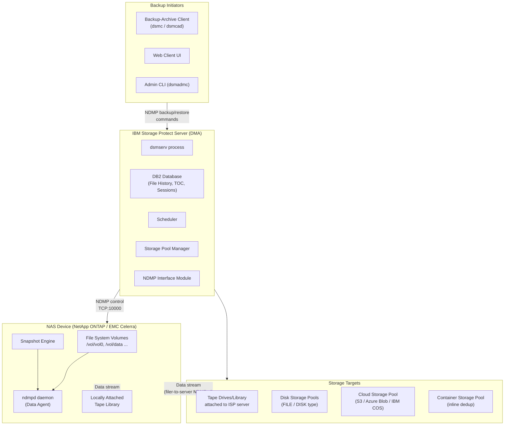
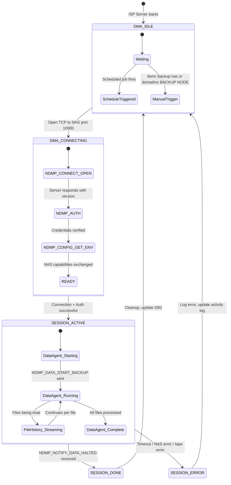
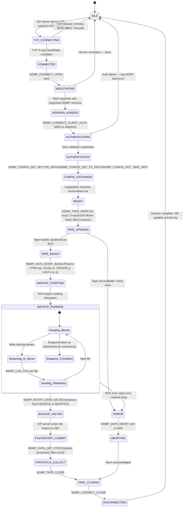
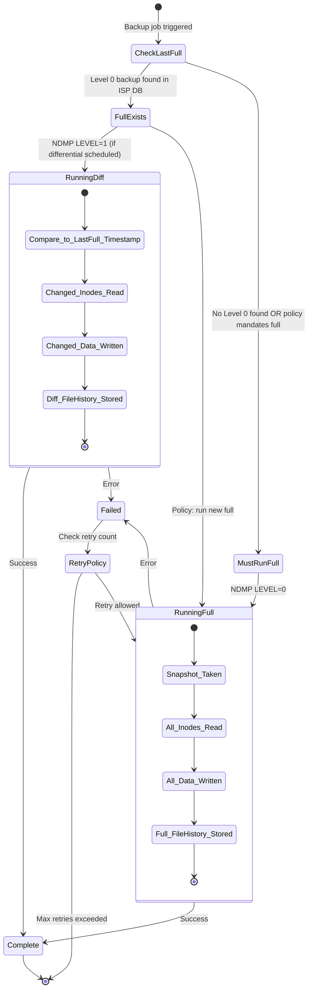
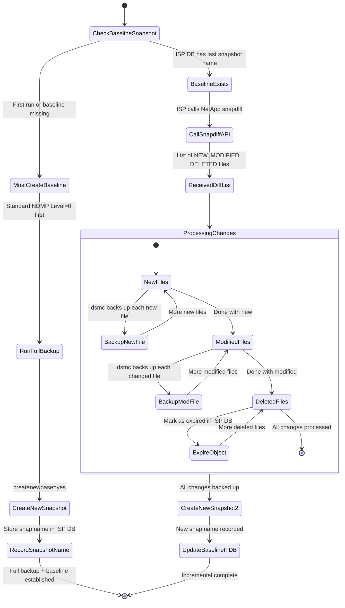
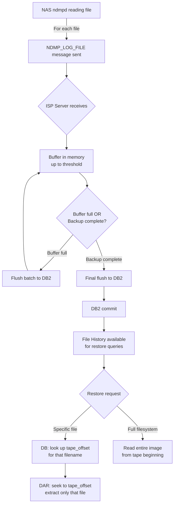
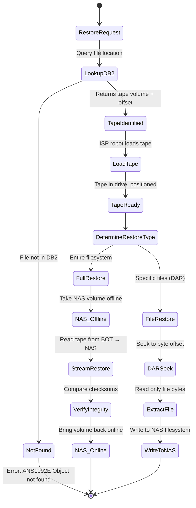
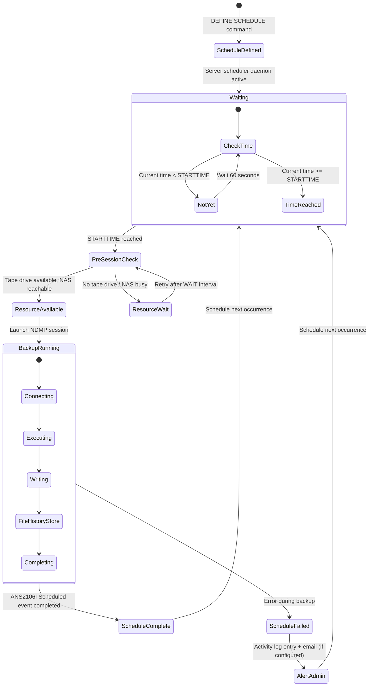
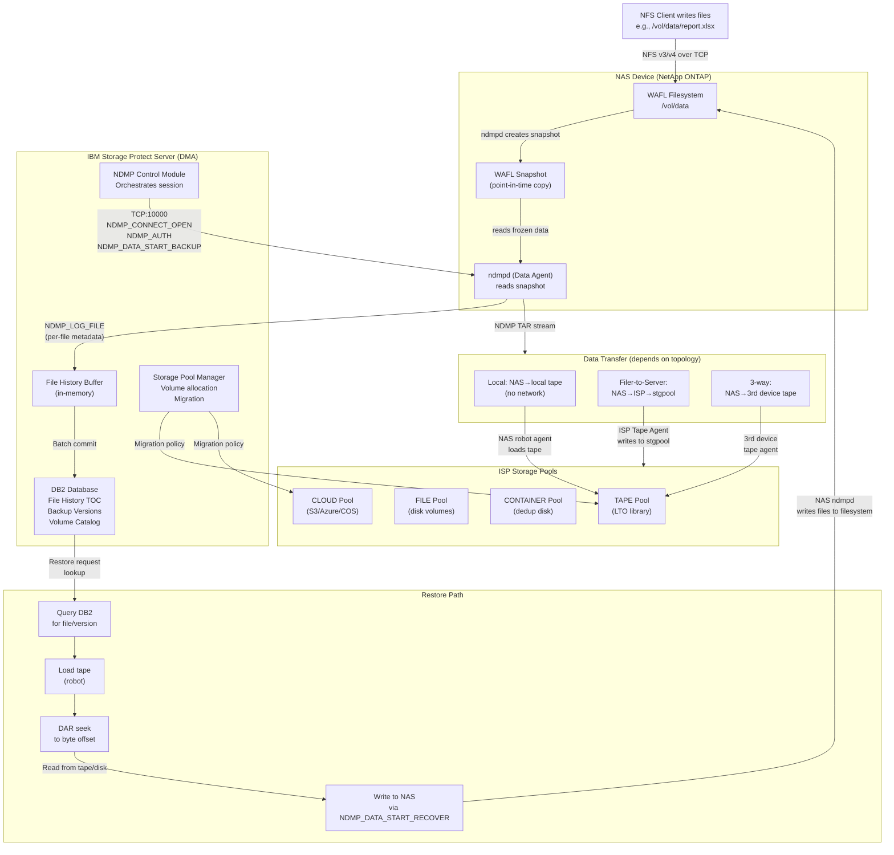

# IBM Storage Protect — Complete NAS/NFS Backup Architecture
## Every Technical Detail: From NFS/NAS Server to Backed-Up Data

> **Product context:** IBM Storage Protect (ISP) — formerly IBM Spectrum Protect, formerly Tivoli Storage Manager (TSM).  
> **Edition required:** IBM Tivoli Storage Manager **Extended Edition** for NDMP support.  
> **Platforms supporting NDMP client:** Windows, AIX®, Solaris backup-archive clients.  
> **Supported NAS targets:** Network Appliance (NetApp) ONTAP, EMC Celerra.

---

## Table of Contents

1. [High-Level Architecture Overview](#1-high-level-architecture-overview)
2. [NDMP Protocol — What It Is and How It Works](#2-ndmp-protocol--what-it-is-and-how-it-works)
3. [NDMP Roles: DMA, Data Agent, Tape Agent, Robot Agent](#3-ndmp-roles-dma-data-agent-tape-agent-robot-agent)
4. [Three NDMP Data Transfer Topologies](#4-three-ndmp-data-transfer-topologies)
5. [NDMP Session State Machine](#5-ndmp-session-state-machine)
6. [Backup Types Supported](#6-backup-types-supported)
7. [Full Backup Flow — Step by Step](#7-full-backup-flow--step-by-step)
8. [Differential Backup Flow — Step by Step](#8-differential-backup-flow--step-by-step)
9. [Snapshot-Based Incremental Backup (NetApp snapdiff)](#9-snapshot-based-incremental-backup-netapp-snapdiff)
10. [File History & Table of Contents (TOC)](#10-file-history--table-of-contents-toc)
11. [Direct Access Restore (DAR)](#11-direct-access-restore-dar)
12. [Restore Flow — Step by Step](#12-restore-flow--step-by-step)
13. [Storage Pool Hierarchy](#13-storage-pool-hierarchy)
14. [NFS as a Storage Pool Backend](#14-nfs-as-a-storage-pool-backend)
15. [Backup-Archive Client Backup of NFS-Mounted Data (Non-NDMP)](#15-backup-archive-client-backup-of-nfs-mounted-data-non-ndmp)
16. [Parallel Operations & Scheduling](#16-parallel-operations--scheduling)
17. [ISP Server Internal Components Involved](#17-isp-server-internal-components-involved)
18. [Network Ports & Communication Channels](#18-network-ports--communication-channels)
19. [What IS Supported vs What IS NOT Supported](#19-what-is-supported-vs-what-is-not-supported)
20. [End-to-End Data Journey — Master Flow Diagram](#20-end-to-end-data-journey--master-flow-diagram)
21. [Interview Cheat Sheet](#21-interview-cheat-sheet)

---

## 1. High-Level Architecture Overview

IBM Storage Protect sits between your NAS devices and your storage targets (tape, disk, cloud). For NAS backup, the central protocol is **NDMP (Network Data Management Protocol)**. The ISP server acts as a **coordinator**, not a data mover — the NAS device moves its own data.

```
┌─────────────────────────────────────────────────────────────────────────┐
│                     IBM Storage Protect Ecosystem                        │
│                                                                          │
│  ┌──────────────┐     NDMP Control     ┌──────────────────────────────┐ │
│  │  ISP Server  │◄────────────────────►│   NAS Device (NetApp/Celerra)│ │
│  │  (DMA)       │     TCP port 10000   │   (Data Agent - ndmpd daemon)│ │
│  │              │                      └──────────────┬───────────────┘ │
│  │  - DB2       │                                     │                 │
│  │  - Stgpools  │                        NDMP Data    │  NFS/CIFS       │
│  │  - Scheduler │                        Stream       │  Clients        │
│  │  - File Hist │                             ▼        │                 │
│  │  - Sessions  │◄──────────────────── ┌─────────────┐◄────────────────┘ │
│  └──────────────┘   (Filer-to-Server)  │  Tape Agent │                 │
│         │                              │  (ISP Server│                 │
│         │                              │   or NAS)   │                 │
│         ▼                              └─────────────┘                 │
│  ┌──────────────┐                             │                        │
│  │ Storage Pool │                             ▼                        │
│  │  - TAPE      │              ┌──────────────────────────────────┐    │
│  │  - DISK      │              │  Tape Library / Tape Drives       │   │
│  │  - CONTAINER │              │  (locally attached to NAS or ISP) │   │
│  │  - CLOUD     │              └──────────────────────────────────┘    │
│  └──────────────┘                                                       │
└─────────────────────────────────────────────────────────────────────────┘
```



---

## 2. NDMP Protocol — What It Is and How It Works

### What is NDMP?

**Network Data Management Protocol (NDMP)** is an open standard protocol (RFC/industry standard) that allows a Data Management Application (DMA) — in this case IBM Storage Protect — to control backup and restore operations on NAS devices **without the data having to flow through the DMA itself**.

Key principle: **The NAS device backs up its own file systems.** ISP tells it what to do; it does the work.

### NDMP Versions

| Version | Key Addition | ISP Relevance |
|---|---|---|
| NDMPv2 | Basic backup/restore, local tape only | Legacy baseline |
| NDMPv3 | 3-way backups (data goes to remote tape server) | Multi-hop topology |
| NDMPv4 | **Filer-to-server transfers**, connection IDs, enhanced notifications | Primary version used for ISP |

> **ISP uses NDMPv4** for filer-to-server data transfer — data flows from the NAS device directly to the ISP server's tape devices over the network. NDMPv3 enables 3-way configurations.

### NDMP Message Types (Key ones)

```
NDMP_CONNECT_*       — Establish connection, exchange version
NDMP_CONFIG_*        — Query NAS capabilities, environment
NDMP_SCSI_*          — Control tape library robot (for robot agent)
NDMP_TAPE_*          — Open/close/read/write tape drives
NDMP_DATA_*          — Start/stop/abort data backup or restore
NDMP_MOVER_*         — Control the data mover (read from tape / write to tape)
NDMP_NOTIFY_*        — Async notifications back to DMA (progress, completion)
NDMP_LOG_*           — File history log (metadata of every file backed up)
NDMP_FHDB_*          — File history database messages
```

### NDMP Data Interface — How Data Actually Moves

```
NAS Data Agent (ndmpd)
        │
        │  NDMP_DATA_START_BACKUP
        │  ─────────────────────►
        │
        ▼
  [Read file system blocks]
        │
        │  NDMP TAR/DUMP stream
        │  ─────────────────────►  Tape Mover (local or remote)
        │                                │
        ▼                                ▼
  [File History (metadata)]      [Write to tape device]
        │
        │  NDMP_LOG_FILE messages
        │  ─────────────────────►  DMA (ISP Server)
                                         │
                                         ▼
                                  [Store in DB2 File History]
```

---

## 3. NDMP Roles: DMA, Data Agent, Tape Agent, Robot Agent

### Role Definitions

```
┌────────────────────────────────────────────────────────────────────┐
│  ROLE              │  WHO PLAYS IT       │  WHAT IT DOES           │
├────────────────────┼─────────────────────┼─────────────────────────┤
│  DMA               │  ISP Server         │  Orchestrates everything │
│  (Data Mgmt App)   │  (dsmserv process)  │  Sends NDMP commands    │
│                    │                     │  Stores file history     │
│                    │                     │  Tracks sessions         │
├────────────────────┼─────────────────────┼─────────────────────────┤
│  Data Agent (DA)   │  NAS Device         │  Reads the NAS file sys  │
│                    │  (ndmpd daemon)     │  Generates backup stream │
│                    │                     │  Sends file metadata     │
├────────────────────┼─────────────────────┼─────────────────────────┤
│  Tape Agent (TA)   │  NAS device (local) │  Receives backup stream  │
│                    │  OR ISP server      │  Writes to tape          │
│                    │  OR 3rd device      │  (the "mover")           │
├────────────────────┼─────────────────────┼─────────────────────────┤
│  Robot Agent (RA)  │  ISP Server         │  Controls tape library   │
│                    │                     │  Mount/unmount tapes     │
│                    │                     │  SCSI robotic commands   │
└────────────────────┴─────────────────────┴─────────────────────────┘
```

### Role State Diagram



---

## 4. Three NDMP Data Transfer Topologies

IBM Storage Protect supports three distinct data movement paths. Understanding all three is critical.

### Topology 1: Local NDMP (NAS-to-Local-Tape)

The simplest and most performant. Data never leaves the NAS box. The NAS device's ndmpd daemon acts as **both Data Agent and Tape Agent**.

```
  ┌──────────────────────────────────────────────────┐
  │         NAS Device (NetApp / EMC Celerra)         │
  │                                                   │
  │  ┌──────────┐  NDMP       ┌──────────────────┐   │
  │  │File Sys  │─────────────►  ndmpd (DA + TA)  │   │
  │  │/vol/data │  TAR stream │                  │   │
  │  └──────────┘             └────────┬─────────┘   │
  │                                    │SCSI / FC     │
  │                           ┌────────▼─────────┐   │
  │                           │  Tape Library     │   │
  │                           │  (locally attached│   │
  │                           │   to NAS)         │   │
  └───────────────────────────┴───────────────────┘

  ISP Server ─── NDMP Control Channel ──► NAS ndmpd
  (DMA only — no data flows through ISP server)
```

**Data path:** NAS filesystem → ndmpd → locally attached tape  
**Network load:** Control channel only (tiny)  
**ISP role:** DMA only — sends commands, receives file history, tracks job  

---

### Topology 2: Filer-to-Server (NDMPv4 — Most Common with ISP)

NAS device acts as **Data Agent only**. ISP server (or ISP-attached tape library) acts as **Tape Agent**. Data flows from NAS to ISP server over the network.

```
  ┌─────────────────────────┐              ┌─────────────────────────┐
  │   NAS Device             │              │   ISP Server             │
  │                          │              │                          │
  │  ┌──────────┐            │   NDMP Data  │  ┌───────────────────┐  │
  │  │File Sys  │──► ndmpd   │─────────────►│  │  Tape Agent       │  │
  │  │          │   (DA)     │  TCP stream  │  │  (in dsmserv)     │  │
  │  └──────────┘            │              │  └────────┬──────────┘  │
  │                          │              │           │SCSI/FC       │
  │                          │              │  ┌────────▼──────────┐  │
  │                          │              │  │  Tape Library /   │  │
  │                          │              │  │  Disk Pool        │  │
  └──────────────────────────┘              └──┴───────────────────┘  │
                                               └─────────────────────┘

  ISP DMA control: ISP Server ──TCP:10000──► NAS ndmpd
  ISP Tape Agent:  NAS ndmpd  ──TCP:data ──► ISP Tape Agent port
```

**Data path:** NAS filesystem → ndmpd → network → ISP server → tape/disk storage pool  
**Network load:** Full backup data traverses LAN/WAN  
**Requires:** NDMPv4 on NAS device  
**Benefit:** Data lands in ISP-managed storage pools — full ISP lifecycle management  

---

### Topology 3: 3-Way NDMP (Filer-to-Third-Device)

Data Agent on NAS. Tape Agent on a **third machine** (typically another server with a tape library attached). ISP remains the DMA only.

```
  ┌──────────┐      Data Stream      ┌──────────────────────┐
  │   NAS    │──────────────────────►│  3rd Device           │
  │  (DA)    │   NDMPv3 connection   │  (Tape Agent)         │
  │  ndmpd   │                       │  Tape Library         │
  └────┬─────┘                       └──────────────────────┘
       │
       │ NDMP Control
       │
  ┌────▼─────────────────────────────┐
  │   ISP Server (DMA only)          │
  │   - Orchestrates both agents     │
  │   - Receives file history        │
  │   - Does NOT handle data         │
  └──────────────────────────────────┘
```

**Data path:** NAS → network → 3rd device tape library  
**ISP role:** Pure orchestration — no data touches ISP server  
**Use case:** When ISP server is remote but a local tape library must be used  

---

### Topology Comparison

| Topology | NDMP Version | Data Crosses Network? | ISP Handles Data? | Storage Location |
|---|---|---|---|---|
| Local NDMP | v2/v3/v4 | No | No | NAS-attached tape |
| Filer-to-Server | v4 | Yes | Yes (Tape Agent) | ISP storage pools |
| 3-Way NDMP | v3/v4 | Yes (NAS→3rd device) | No (DMA only) | 3rd device tape |

---

## 5. NDMP Session State Machine

This is the complete lifecycle of a single NDMP backup session from start to finish.



---

## 6. Backup Types Supported

### 6.1 Level 0 — Full Image Backup

```
Backup Level: LEVEL=0 (set in NDMP environment)
Scope:        ALL files in the NAS file system volume
Method:       NAS snapshots the volume at backup start, then reads ALL inodes
Output:       NDMP TAR stream → tape / ISP storage pool
File History: FULL catalog of every file, size, mtime, owner, permissions
Update bit:   After successful Level 0, NAS records the "last full backup" timestamp
```

```
Timeline:
──────────────────────────────────────────────────────────────────
T=0    ISP triggers NDMP_DATA_START_BACKUP LEVEL=0
T=1    NAS creates internal consistency snapshot
T=2    NAS reads ALL filesystem blocks from snapshot
T=3    File history streamed to ISP for every file
T=4    Backup stream written to tape
T=5    ISP records: "Last full backup time = T=0"
T=6    File history committed to DB2
──────────────────────────────────────────────────────────────────
```

### 6.2 Level 1 — Differential Backup

```
Backup Level: LEVEL=1
Scope:        All files CHANGED SINCE last Level 0 (not since last Level 1)
Method:       NAS compares current inode mtimes against stored Level 0 timestamp
Output:       NDMP TAR stream containing ONLY changed/new files
File History: Catalog of only the changed files in this backup
```

> **Important:** IBM Storage Protect uses a **2-level scheme only** (Level 0 = full, Level 1 = differential). It does NOT use a full incremental (Level 2, 3, 4...) scheme natively via NDMP. For true incrementals, use snapshot-based backup (Section 9).

### 6.3 Differential Backup — What Changes ISP Tracks

```
                    Full Backup (Level 0)
                          │
            ┌─────────────┴─────────────┐
            │                           │
         Diff 1 (Level 1)           Diff 2 (Level 1)
    "All changes since Full"    "All changes since Full"
    (NOT since Diff 1)          (NOT since Diff 1)
            │                           │
       Restore = Full + Diff 1     Restore = Full + Diff 2
```

### 6.4 Backup Type State Diagram



---

## 7. Full Backup Flow — Step by Step

This is every action in sequence, down to the function level.

```
STEP 1: Job Initiation
━━━━━━━━━━━━━━━━━━━━━━━━━━━━━━━━━━━━━━━━━━━━━━━━━━━━━━━━━━━
  Initiated by: 
    - dsmc backup nas -nasnodename=NASNODE01 (BA client command)
    - dsmadmc "BACKUP NODE NASNODE01 TYPE=NAS"
    - Scheduled BACKUP NAS command on ISP server
    - Web client / Administrative web console

STEP 2: ISP Server prepares session
━━━━━━━━━━━━━━━━━━━━━━━━━━━━━━━━━━━━━━━━━━━━━━━━━━━━━━━━━━━
  ISP server looks up:
    - NAS node definition (DEFINE NODE NASNODE01 TYPE=NAS)
    - NAS device IP address / hostname
    - NDMP credentials (username/password stored in ISP)
    - Which storage pool to use (DEFINE STGPOOL NASTAPE DEVCLASS=TAPELIBRARY)
    - Tape device class assignments

STEP 3: TCP connection to NAS ndmpd
━━━━━━━━━━━━━━━━━━━━━━━━━━━━━━━━━━━━━━━━━━━━━━━━━━━━━━━━━━━
  ISP server → TCP SYN → NAS IP:10000
  NAS ndmpd → TCP SYN-ACK
  ISP server → TCP ACK
  Connection established.

STEP 4: NDMP version negotiation
━━━━━━━━━━━━━━━━━━━━━━━━━━━━━━━━━━━━━━━━━━━━━━━━━━━━━━━━━━━
  ISP sends:  NDMP_CONNECT_OPEN { client_min_version=2, client_max_version=4 }
  NAS sends:  NDMP_CONNECT_OPEN reply { server_version=4, error=NDMP_NO_ERR }
  Agreed version: NDMPv4

STEP 5: Authentication
━━━━━━━━━━━━━━━━━━━━━━━━━━━━━━━━━━━━━━━━━━━━━━━━━━━━━━━━━━━
  ISP sends:  NDMP_CONNECT_CLIENT_AUTH {
                auth_type = NDMP_AUTH_MD5,
                auth_id   = "ndmpuser",
                auth_data = MD5(challenge + password)
              }
  NAS ndmpd validates credentials against local NAS user database.
  NAS sends:  NDMP_REPLY { error=NDMP_NO_ERR }

STEP 6: Configuration exchange
━━━━━━━━━━━━━━━━━━━━━━━━━━━━━━━━━━━━━━━━━━━━━━━━━━━━━━━━━━━
  ISP sends:  NDMP_CONFIG_GET_HOST_INFO
  NAS replies: hostname, OS type, OS version, hostid

  ISP sends:  NDMP_CONFIG_GET_FS_INFO
  NAS replies: list of filesystems:
               /vol/vol0  (NFS exported, 2.1TB, WAFL filesystem)
               /vol/data  (NFS exported, 5.8TB, WAFL filesystem)

  ISP sends:  NDMP_CONFIG_GET_BUTYPE_INFO
  NAS replies: backup types supported:
               dump (UNIX dump format), tar (NDMP TAR)
               Supported env vars: LEVEL, UPDATE, HIST, FILES, DIRECT

  ISP sends:  NDMP_CONFIG_GET_TAPE_INFO  (if local topology)
  NAS replies: tape devices, library info

STEP 7: Tape / mover setup (Filer-to-Server topology)
━━━━━━━━━━━━━━━━━━━━━━━━━━━━━━━━━━━━━━━━━━━━━━━━━━━━━━━━━━━
  For filer-to-server:
    ISP opens listen socket on ISP server (mover port)
    ISP sends NAS the address:port of ISP tape agent
    NAS will connect to this to send data

  For local NDMP:
    ISP sends:  NDMP_TAPE_OPEN { device="/dev/nrst0", mode=NDMP_TAPE_RDWR }
    NAS opens tape device, positions to BOT (Beginning of Tape)
    NAS sends:  NDMP_TAPE_OPEN reply { error=NDMP_NO_ERR }
    
    ISP sends:  NDMP_MOVER_SET_RECORD_SIZE { len=65536 }  (64KB blocks)
    ISP sends:  NDMP_MOVER_SET_WINDOW { offset=0, length=NDMP_LENGTH_INFINITY }
    ISP sends:  NDMP_MOVER_LISTEN (tells mover to start accepting data)

STEP 8: Backup environment setup
━━━━━━━━━━━━━━━━━━━━━━━━━━━━━━━━━━━━━━━━━━━━━━━━━━━━━━━━━━━
  ISP sends:  NDMP_DATA_SET_ENV {
                "FILESYSTEM" = "/vol/data",
                "TYPE"       = "tar",
                "LEVEL"      = "0",          ← Full backup
                "UPDATE"     = "y",          ← Record backup timestamp on NAS
                "HIST"       = "f"           ← f=file-based history, d=dir-only
              }

STEP 9: Snapshot creation (NAS internal)
━━━━━━━━━━━━━━━━━━━━━━━━━━━━━━━━━━━━━━━━━━━━━━━━━━━━━━━━━━━
  NAS ndmpd internally creates a WAFL (Write Anywhere File Layout) snapshot
  of /vol/data at exactly this moment.
  This provides:
    - Point-in-time consistency (no dirty files)
    - Live filesystem continues to be modified by NFS clients
    - Backup reads from frozen snapshot, not live data

STEP 10: Backup execution
━━━━━━━━━━━━━━━━━━━━━━━━━━━━━━━━━━━━━━━━━━━━━━━━━━━━━━━━━━━
  ISP sends:  NDMP_DATA_START_BACKUP { butype_name="tar" }
  NAS ndmpd:
    - Reads snapshot of /vol/data
    - For EVERY file in the filesystem:
        ┌─ Read inode (metadata: size, mtime, owner, perms, ACL)
        ├─ Read file data blocks
        ├─ Package as NDMP TAR header + data
        └─ Send to Tape Agent (local or remote)
    - Simultaneously:
        ├─ Send NDMP_LOG_FILE message for each file
        │   Contains: filename, size, mtime, fileno, offset-on-tape
        └─ ISP server receives these and buffers them for DB2

STEP 11: Data written to storage
━━━━━━━━━━━━━━━━━━━━━━━━━━━━━━━━━━━━━━━━━━━━━━━━━━━━━━━━━━━
  Data stream → Tape Agent → Physical tape / disk storage pool
  Written as "NDMP image" backup object in ISP storage pool
  Tagged with: NAS node name, filesystem path, backup timestamp, sequence number

STEP 12: File history commit
━━━━━━━━━━━━━━━━━━━━━━━━━━━━━━━━━━━━━━━━━━━━━━━━━━━━━━━━━━━
  After NDMP_NOTIFY_DATA_HALTED received:
    ISP flushes all buffered NDMP_LOG_FILE entries to DB2
    Each entry: {filespace, filename, size, mtime, tape_offset, backup_id}
    This is the "Table of Contents" (TOC) enabling file-level restore

STEP 13: NAS timestamp update
━━━━━━━━━━━━━━━━━━━━━━━━━━━━━━━━━━━━━━━━━━━━━━━━━━━━━━━━━━━
  Because UPDATE=y was set:
    NAS ndmpd records the backup completion time in WAFL metadata
    This timestamp is used by Level 1 (differential) backups
    to determine "changed since this time"

STEP 14: Session cleanup
━━━━━━━━━━━━━━━━━━━━━━━━━━━━━━━━━━━━━━━━━━━━━━━━━━━━━━━━━━━
  ISP sends: NDMP_TAPE_CLOSE (if local)
  ISP sends: NDMP_CONNECT_CLOSE
  TCP connection torn down
  ISP updates: activity log, backup version record in DB2
```

---

## 8. Differential Backup Flow — Step by Step

Everything is the same as a full backup EXCEPT:

```
STEP 8 (differs): Backup environment setup
━━━━━━━━━━━━━━━━━━━━━━━━━━━━━━━━━━━━━━━━━━━━━━━━━━━━━━━━━━━
  ISP sends:  NDMP_DATA_SET_ENV {
                "FILESYSTEM" = "/vol/data",
                "TYPE"       = "tar",
                "LEVEL"      = "1",          ← Differential (not full)
                "UPDATE"     = "y",
                "HIST"       = "f"
              }

STEP 9 (differs): NAS computes changed files
━━━━━━━━━━━━━━━━━━━━━━━━━━━━━━━━━━━━━━━━━━━━━━━━━━━━━━━━━━━
  NAS ndmpd:
    - Reads the stored Level-0 backup timestamp from WAFL metadata
    - Creates snapshot of /vol/data
    - Walks the inode table
    - For each file: IF mtime > Level-0-timestamp → include in backup
    - Backs up ONLY those changed files

STEP 10 (differs): Only changed data sent
━━━━━━━━━━━━━━━━━━━━━━━━━━━━━━━━━━━━━━━━━━━━━━━━━━━━━━━━━━━
  Far less data than Level 0 backup
  File history contains only changed files
  ISP stores this as a new backup version, linked to the base Level 0
```

---

## 9. Snapshot-Based Incremental Backup (NetApp snapdiff)

This is the most advanced NAS backup method in ISP — enables true file-level incrementals using NetApp's native snapshot comparison engine.

### How snapdiff Works

```
NetApp ONTAP internal snapshot mechanism:
  Every snapshot is a point-in-time frozen view of the volume.
  snapdiff API compares TWO snapshots and returns a list of:
    - New files
    - Modified files
    - Deleted files
  This is O(changed files) not O(all files) — far faster than inode walk.
```

### ISP Options Involved

| Option | Purpose |
|---|---|
| `snapshotroot` | Path to a NAS snapshot to use as backup source |
| `snapdiff` | Enable NetApp snapdiff API to find changed files |
| `createnewbase` | Tell ISP to create a new base snapshot after this backup |
| `diffsnapshot` | Name of the previous snapshot to diff against |

### snapdiff Backup Flow

```
Timeline:
─────────────────────────────────────────────────────────────────────

  T-1:  Snapshot "snap_baseline" exists on NetApp
         (created during last ISP backup with createnewbase=yes)

  T=0:  New ISP backup triggered with:
         dsmc incr /vol/data
           -snapdiff
           -createnewbase=yes
           -diffsnapshot=snap_baseline

  T=1:  ISP calls NetApp snapdiff API:
         COMPARE(snap_baseline, current)
         NetApp returns: list of {filename, change_type: NEW|MODIFIED|DELETED}

  T=2:  ISP backs up ONLY the files in the diff list
         (File-by-file backup, NOT NDMP image backup)
         → Far smaller backup set

  T=3:  ISP records deletions as "expired objects" in DB2

  T=4:  NetApp creates new snapshot "snap_new" (because createnewbase=yes)
         "snap_new" becomes the baseline for next backup run

  T=5:  Old "snap_baseline" may be deleted (or retained per policy)
─────────────────────────────────────────────────────────────────────
```

### snapdiff State Diagram



---

## 10. File History & Table of Contents (TOC)

File history is what makes NDMP image backups useful for restoring individual files.

### What ISP Stores in DB2 for Each File

```
For every file backed up via NDMP:
┌─────────────────────────────────────────────────────────────────────┐
│  DB2 Table: FILECOPYINFO / BACKUPCOPY (simplified)                  │
│                                                                     │
│  NODE_NAME      = 'NASNODE01'                                       │
│  FILESPACE_ID   = 1  (maps to /vol/data)                            │
│  FILE_NAME      = '/vol/data/projects/report.xlsx'                  │
│  FILE_SIZE      = 2097152  (2MB)                                    │
│  MTIME          = 2024-01-15 09:23:11                               │
│  BACKUP_DATE    = 2024-01-20 02:00:00                               │
│  STGPOOL_NAME   = 'NASTAPE'                                         │
│  TAPE_VOLUME    = 'TSM001'                                          │
│  TAPE_OFFSET    = 1073741824  (byte offset on tape)                 │
│  OBJECT_ID      = 8837492                                           │
│  BACKUP_LEVEL   = 0  (from full backup)                             │
│  ACL_DATA       = (binary ACL blob)                                 │
└─────────────────────────────────────────────────────────────────────┘
```

### HIST Option Values

```
HIST=f  → File-based history
          Every single file's metadata stored in ISP DB
          Enables: file-level restore, search by filename
          DB size: Large (proportional to file count)

HIST=d  → Directory-based history only
          Only directory structure stored, not individual files
          Enables: directory-level restore
          DB size: Small
          Limitation: Cannot search for individual files
          Restore: Must read full image and extract desired files

HIST=n  → No history
          No file catalog stored at all
          Restore: Must restore entire filesystem image
          Use case: Pure DR / no file-level restore needed
```

### File History Flow



---

## 11. Direct Access Restore (DAR)

DAR is the mechanism that makes file-level restore from an NDMP image backup practical.

### Without DAR (Non-DAR Restore)

```
Restore of /vol/data/projects/report.xlsx:
  1. ISP loads tape TSM001 into drive
  2. Tape rewinds to BOT (Beginning of Tape)
  3. NAS ndmpd reads ENTIRE TAR stream sequentially
  4. For every file in the stream: check if it matches request
  5. When match found: extract it
  
  Cost: Read entire tape from start (could be hours for large backups)
```

### With DAR (Direct Access Restore)

```
Restore of /vol/data/projects/report.xlsx:
  1. ISP queries DB2: 
     SELECT tape_offset FROM filecopyinfo WHERE file_name='report.xlsx'
     → Returns: offset = 1,073,741,824 bytes
  2. ISP loads tape TSM001
  3. ISP sends NAS: NDMP_DATA_START_RECOVER with DAR=y, offset=1073741824
  4. NAS ndmpd sends NDMP_MOVER_SET_WINDOW { offset=1073741824, length=4096000 }
  5. Tape drive seeks directly to byte position 1,073,741,824
  6. Reads ONLY the file's data
  7. Extracts and restores the file
  
  Cost: Seek time + read file size only (seconds to minutes)
```

### DAR Requirements

```
1. File history must have been captured during backup (HIST=f)
2. NAS device must support DAR (NetApp ONTAP and EMC Celerra do)
3. NDMP environment variable: DIRECT=y  must be set
4. Tape drive must support fast seek (most modern drives do)
```

---

## 12. Restore Flow — Step by Step

### Full Filesystem Restore

```
dsmc restore nas -nasnodename=NASNODE01 /vol/data
  OR
dsmadmc "RESTORE NODE NASNODE01 FILESPACENAME=/vol/data"
```

```
STEP 1: ISP queries DB2 for latest backup version of /vol/data
         → Returns: tape TSM001, backup_date=2024-01-20, full image

STEP 2: ISP connects to NAS ndmpd (TCP:10000), authenticates

STEP 3: ISP instructs NAS to prepare /vol/data for overwrite
         (NAS takes the volume offline or uses SnapRestore)

STEP 4: Tape setup
         For filer-to-server: ISP opens tape TSM001, sets up mover
         For local: ISP sends NDMP_TAPE_OPEN to NAS-attached library

STEP 5: ISP sends NDMP_DATA_START_RECOVER:
         {
           butype_name = "tar",
           nlist = [{ fh_info=0, dest="/vol/data" }]  ← full restore
         }

STEP 6: Data flows: tape → tape agent → NAS ndmpd → /vol/data filesystem
         NAS extracts all files from the NDMP TAR stream

STEP 7: If differential backup also needed:
         After Level 0 restore: apply Level 1 restore too
         ISP loads differential tape, repeats STEP 5-6 with LEVEL=1 data

STEP 8: NAS verifies restore integrity, brings volume back online
STEP 9: NFS clients can reconnect
```

### File-Level Restore (with DAR)

```
dsmc restore nas "/vol/data/projects/report.xlsx"
  -nasnodename=NASNODE01
  -tonasnodename=NASNODE01

STEP 1: ISP DB2 lookup: find tape + offset for this file
STEP 2: Connect to NAS ndmpd
STEP 3: Open tape, seek to offset (DAR)
STEP 4: NDMP_DATA_START_RECOVER with specific file path + DAR offset
STEP 5: NAS receives only that file's bytes, writes to filesystem
STEP 6: Done
```

### Restore State Diagram



---

## 13. Storage Pool Hierarchy

### Storage Pool Types in ISP

```
┌────────────────────────────────────────────────────────────────────────┐
│                     ISP Storage Pool Hierarchy                          │
│                                                                         │
│  ┌─────────────┐    ┌─────────────┐    ┌─────────────────────────┐    │
│  │  PRIMARY     │    │  COPY        │    │  ACTIVE-DATA            │    │
│  │  STGPOOL     │───►│  STGPOOL     │    │  STGPOOL                │    │
│  │              │    │  (DR copy)   │    │  (only active versions) │    │
│  │  Where NDMP  │    │              │    │                         │    │
│  │  data lands  │    │              │    │                         │    │
│  └─────────────┘    └─────────────┘    └─────────────────────────┘    │
│         │                                                               │
│    ┌────┴───────────────────────────────────────────────────┐          │
│    │           Primary Pool Types                            │          │
│    ├──────────┬──────────┬───────────┬──────────┬──────────┤          │
│    │  DISK     │  FILE    │  TAPE     │CONTAINER │  CLOUD   │          │
│    │          │          │           │(dedup)   │(S3/Azure)│          │
│    │ Random   │ Seq disk │ Tape lib  │ Inline   │ Object   │          │
│    │ disk I/O │ volumes  │ drives    │ dedup    │ storage  │          │
│    └──────────┴──────────┴───────────┴──────────┴──────────┘          │
└────────────────────────────────────────────────────────────────────────┘
```

### Storage Pool for NDMP Backups

```
NDMP backup data typically lands in:
  └─ TAPE storage pool (for local NDMP or filer-to-server to tape)
  └─ FILE storage pool (for filer-to-server to disk sequential files)
  └─ CONTAINER storage pool (for filer-to-server with inline dedup)
  └─ CLOUD storage pool (for filer-to-server to cloud object storage)

ISP server commands to define:
  DEFINE DEVCLASS TAPELIBRARY DEVTYPE=LTO LIBRARY=NASLIB
  DEFINE STGPOOL NASTAPE DEVCLASS=TAPELIBRARY MAXSCRATCH=200
  DEFINE NODE NASNODE01 DOMAIN=NAS_POLICY TYPE=NAS
    NDMPPASSWORD=<password> NDMPPORT=10000

Migration policies (how data moves between pools):
  Data in DISK pool → migrate to TAPE pool after N days (MIGPROCESS)
  Data in FILE pool → migrate to CONTAINER pool (deduplicate)
  Data in TAPE pool → can reclaim (consolidate) to new tape volumes
```

---

## 14. NFS as a Storage Pool Backend

ISP itself can use NFS-mounted directories as the physical location for FILE or DISK storage pools. This is separate from NDMP backup — this is ISP server's own storage infrastructure.

### Architecture

```
  ┌─────────────────────────────────────────────────────────────────┐
  │  ISP Server Host (AIX / Linux / Windows)                         │
  │                                                                  │
  │  /tsmdata/pool1/    ← NFS MOUNT POINT                           │
  │       │                                                          │
  │       │  NFS v3/v4 mount                                        │
  │       │                                                          │
  │  ┌────▼──────────────────────────────────┐                      │
  │  │  ISP STGPOOL DEFINITION               │                      │
  │  │  DEFINE STGPOOL NASPOOL               │                      │
  │  │    DEVCLASS=DISK                      │                      │
  │  │    MAXCAPACITY=10T                    │                      │
  │  │    DIRECTORY=/tsmdata/pool1           │ ◄── NFS path          │
  │  └────────────────────────────────────────┘                     │
  └─────────────────────────────────────────────────────────────────┘
                              │
              NFS v3/v4 over TCP
                              │
  ┌─────────────────────────────────────────────────────────────────┐
  │  NFS Server (NAS / dedicated NFS server)                         │
  │                                                                  │
  │  Export: /export/tsmpool → ISP server IP                        │
  │  Physical: SAS/NVMe disks, RAID5/6                              │
  └─────────────────────────────────────────────────────────────────┘
```

### NFS Stgpool Write Path (BA Client Backup)

```
 ┌──────────────────┐           ┌──────────────────────────────────────┐
 │  BA Client       │           │  ISP Server                          │
 │  (dsmc)          │           │                                      │
 │                  │  TCP:1500 │  ┌─────────────┐                    │
 │  backup /data/*  │──────────►│  │ Session Mgr  │                   │
 │                  │           │  │ (dsmserv)   │                    │
 │  - File data     │           │  └──────┬──────┘                    │
 │  - Metadata      │           │         │                            │
 │  - Compression   │           │  ┌──────▼──────┐                    │
 │    (optional)    │           │  │ Stgpool Mgr  │                   │
 └──────────────────┘           │  └──────┬──────┘                    │
                                │         │ POSIX write()             │
                                │  ┌──────▼──────────────────────┐   │
                                │  │/tsmdata/pool1/00/           │   │
                                │  │  AAABBCCC.BKP (ISP vol file) │  │
                                │  └──────┬───────────────────────┘  │
                                └─────────│──────────────────────────┘
                                          │
                              NFS write over TCP
                                          │
                                          ▼
                               ┌──────────────────────┐
                               │ NFS Server filesystem │
                               │ /export/tsmpool/00/   │
                               │   AAABBCCC.BKP        │
                               └──────────────────────┘
```

### NFS Stgpool Issues to Know

```
Issue 1: Stale filehandle (ESTALE)
  Cause:   NFS server reboots, NFS export path changes, volume unmounted
  Effect:  ISP storage pool operations fail — WRITE/READ to stgpool fails
  ISP error: ANR8302E, ANR8443E
  Fix:     Remount NFS on ISP host, restart ISP server or wait for reconnect

Issue 2: NFS mount goes stale under heavy load
  Cause:   NFS server overloaded, network packet loss
  Effect:  ISP processes hang waiting on NFS I/O (uninterruptible sleep)
  Fix:     Use soft NFS mount with timeo and retrans options
           mount -o soft,timeo=30,retrans=3 server:/export /tsmdata/pool1

Issue 3: Write consistency
  ISP expects POSIX write semantics (fsync = data on stable storage)
  NFS with async server = data in NFS server buffer, not disk
  Fix:     Use sync NFS server export OR enable NFS client sync mount
           For production: always use sync NFS mounts for ISP stgpools

Issue 4: File locking
  ISP uses POSIX file locks for stgpool volume exclusive access
  NFSv3 uses NLM (separate lockd daemon) — can fail independently
  NFSv4 has built-in locking — more reliable
  Recommendation: Use NFSv4 for ISP storage pool mounts
```

---

## 15. Backup-Archive Client Backup of NFS-Mounted Data (Non-NDMP)

When you mount an NFS share on a backup-archive client and back it up with `dsmc`, this is **not NDMP**. This is regular BA client backup over TCP.

### Architecture

```
  NAS Device                  Client Host                  ISP Server
  ─────────                   ───────────                  ──────────
  /vol/shared  ──NFS mount──► /mnt/nas_data                
               (NFSv3/v4)         │
                                  │  dsmc backup /mnt/nas_data
                                  │  ─────────────────────────────────────►
                                  │                            ISP receives:
                                  │                            - File metadata
                                  │  TCP:1500 (ISP protocol)   - Compressed data
                                  │                            - Dedup (optional)
                                  │                                    │
                                  │                            ┌───────▼──────┐
                                  │                            │  Storage Pool │
                                  │                            │  (disk/tape/  │
                                  │                            │   container/  │
                                  │                            │   cloud)      │
                                  │                            └──────────────┘
```

### Key Differences: NDMP vs BA-Client NFS Backup

| Aspect | NDMP Backup | BA-Client NFS Backup |
|---|---|---|
| Data path | NAS → tape/ISP (no intermediate) | NAS → NFS → client → ISP server |
| Network hops | 1 (NAS to storage) | 2 (NAS to client, client to ISP) |
| Performance | High — native NAS I/O | Lower — double network traversal |
| File-level restore | Yes (with HIST=f and DAR) | Yes (native ISP file restore) |
| Snapshot support | WAFL snapshots (NetApp) | snapdiff (NetApp) or manual snapshot |
| Metadata | NDMP TAR preserves NAS-native metadata | POSIX metadata only |
| ACLs | Full NAS ACLs (NTFS, NFS ACLs) | Only what the OS can read |
| Changed files | NAS-side inode comparison (Level 1) | ISP client-side change detection |
| LAN-free | Yes (local NDMP or 3-way) | No — always traverses network |

---

## 16. Parallel Operations & Scheduling

### Parallel Backup of Multiple NAS Filesystems

```
ISP Server can run multiple NDMP sessions simultaneously:

  Session 1: NASNODE01 /vol/data     ──── tape drive 1 ───► TSM_TAPE_001
  Session 2: NASNODE01 /vol/projects ──── tape drive 2 ───► TSM_TAPE_002
  Session 3: NASNODE02 /vol/home     ──── tape drive 3 ───► TSM_TAPE_003

Control parameter:
  DEFINE SCHEDULE NAS_FULL DOMAIN=NAS_POLICY ...
  Maximum parallel NDMP sessions: DEFINE SERVER NDMPPORT=10000 MAXSESSIONS=nn
  
Each NAS filesystem = independent NDMP session = independent TCP connection
Multiple NDMP sessions to SAME NAS device = NAS allows multiple concurrent ndmpd connections
```

### Scheduling NDMP Backups (Admin CLI Only)

> **Critical:** NAS backups CANNOT be scheduled by the BA client scheduler. They MUST be scheduled using **server-side administrative commands**.

```sql
-- Define a NAS backup schedule
DEFINE SCHEDULE NAS_POLICY NAS_WEEKLY_FULL
  TYPE=ADMINISTRATIVE
  CMD="BACKUP NODE NASNODE01 FILESPACENAME=/vol/data"
  ACTIVE=YES
  STARTTIME=02:00
  PERIOD=7
  PERUNITS=DAYS

-- Define differential schedule
DEFINE SCHEDULE NAS_POLICY NAS_DAILY_DIFF
  TYPE=ADMINISTRATIVE  
  CMD="BACKUP NODE NASNODE01 FILESPACENAME=/vol/data INCREMENTAL=DIFFERENTIAL"
  ACTIVE=YES
  STARTTIME=22:00
  PERIOD=1
  PERUNITS=DAYS

-- Monitoring
QUERY ACTLOG ORIGNODE=NASNODE01    ← See all NDMP session activity
QUERY SESSION                      ← Active sessions
QUERY PROCESS                      ← Running backup/restore processes
```

### Schedule State Diagram



---

## 17. ISP Server Internal Components Involved

```
┌──────────────────────────────────────────────────────────────────────┐
│                    dsmserv process (ISP Server)                       │
│                                                                       │
│  ┌─────────────────┐  ┌─────────────────┐  ┌─────────────────────┐ │
│  │  Session Manager │  │  NDMP Interface  │  │  DB2 Interface      │ │
│  │                 │  │  Module          │  │                     │ │
│  │  - TCP listener  │  │                 │  │  - File history     │ │
│  │    port 1500     │  │  - NDMP message  │  │  - Backup versions  │ │
│  │  - Auth sessions │  │    encoder/     │  │  - Volume catalog   │ │
│  │  - Rate limiting │  │    decoder      │  │  - Node registry    │ │
│  └────────┬────────┘  │  - Connection   │  │  - Schedule defs    │ │
│           │           │    pool to NAS  │  └─────────────────────┘ │
│           │           │  - Async notif  │                           │
│           ▼           │    handler      │  ┌─────────────────────┐ │
│  ┌────────────────┐   └────────┬────────┘  │  Storage Pool Mgr   │ │
│  │  Command Parser│            │            │                     │ │
│  │  (dsmadmc/     │            │            │  - Volume selection  │ │
│  │   web/BA cmd)  │            │            │  - Scratch tape mgmt│ │
│  └────────────────┘            │            │  - Mount requests   │ │
│                                │            │  - Migration jobs   │ │
│  ┌────────────────┐            │            │  - Reclamation      │ │
│  │  Scheduler     │            │            └─────────────────────┘ │
│  │  Daemon        │            │                                     │
│  │  (admin sched) │            │            ┌─────────────────────┐ │
│  └────────────────┘            │            │  Device Manager     │ │
│                                │            │                     │ │
│  ┌────────────────┐            │            │  - Tape library     │ │
│  │  Activity Log  │◄───────────┘            │    robot control    │ │
│  │  Manager       │                         │  - Drive allocation  │ │
│  │                │                         │  - Label scanning   │ │
│  │  Writes to DB2 │                         └─────────────────────┘ │
│  └────────────────┘                                                  │
└──────────────────────────────────────────────────────────────────────┘
```

### DB2 Tables Critical for NDMP

```sql
-- Key tables ISP uses internally (conceptual, not actual DDL):

NODES           -- NAS node registration (TYPE=NAS, NDMPPORT, credentials)
FILESPACES      -- Maps node+filesystem → filespace ID
                --   NASNODE01, /vol/data → fsid=1
BACKUPOBJECTS   -- Every backup version record
                --   objid, fsid, type=IMAGE, backup_date, stgpool, volume, offset
FILECOPYINFO    -- File history (one row per file per backup)
                --   objid, filename, filesize, mtime, tape_offset, inode_num
VOLUMEUSAGE     -- Which ISP tape volumes contain which backup data
ACTLOG          -- Activity log for all operations
SESSIONS        -- Active and historical session records
SCHEDULES       -- Administrative schedule definitions
```

---

## 18. Network Ports & Communication Channels

```
┌────────────────────────────────────────────────────────────────────────┐
│  Connection              │  Protocol  │  Port  │  Direction            │
├────────────────────────────────────────────────────────────────────────┤
│  BA Client → ISP Server  │  TCP       │  1500  │  Client initiates     │
│  (backup initiation)     │            │        │                       │
├────────────────────────────────────────────────────────────────────────┤
│  ISP Server → NAS ndmpd  │  TCP       │  10000 │  ISP server initiates │
│  (NDMP control channel)  │            │  (def) │  (DMA → Data Agent)   │
├────────────────────────────────────────────────────────────────────────┤
│  NAS ndmpd → ISP Tape    │  TCP       │  dynamic│ NAS initiates        │
│  Agent (data channel)    │            │        │  (NDMPv4 filer-to-svr)│
├────────────────────────────────────────────────────────────────────────┤
│  ISP Server → ISP Server │  TCP       │  1500  │  Internal (replica)   │
│  (node replication)      │            │        │                       │
├────────────────────────────────────────────────────────────────────────┤
│  ISP Server → Cloud      │  HTTPS     │  443   │  Cloud storage pool   │
│  (S3 / Azure Blob)       │            │        │                       │
├────────────────────────────────────────────────────────────────────────┤
│  dsmadmc → ISP Server    │  TCP       │  1500  │  Admin client         │
│  (admin commands)        │            │        │                       │
└────────────────────────────────────────────────────────────────────────┘

Firewall rules needed for NDMP:
  ISP Server IP → NAS IP : TCP port 10000  (DMA control)
  NAS IP → ISP Server IP : TCP ephemeral   (data channel, filer-to-server)
  
Note: For local NDMP, only control channel needed (no data crosses network)
```

---

## 19. What IS Supported vs What IS NOT Supported

### Supported (from official documentation + technical detail)

```
✅ Full file system image backup (NDMP LEVEL=0)
✅ Differential file system image backup (NDMP LEVEL=1)
✅ Snapshot-based incremental via snapdiff (NetApp specific)
✅ Parallel backup/restore of multiple filesystems simultaneously
✅ File history (TOC) for file-level restore from image backup
✅ Direct Access Restore (DAR) for individual file extraction
✅ Local NDMP (NAS to locally attached tape)
✅ Filer-to-server data transfer (NDMPv4)
✅ 3-way NDMP transfers
✅ LAN-free data transfer (local NDMP topology)
✅ Web client interface for initiation and monitoring
✅ BA client command interface (dsmc backup nas)
✅ Administrative command line (dsmadmc)
✅ Administrative web client
✅ Server-side scheduling (DEFINE SCHEDULE TYPE=ADMINISTRATIVE)
✅ Cancel/abort operations via all interfaces
✅ NetApp ONTAP NAS devices
✅ EMC Celerra NAS devices
✅ NFS filesystem backup via NDMP
✅ CIFS filesystem backup via NDMP
```

### NOT Supported

```
❌ Archive and retrieve for NAS data
     (ISP ARCHIVE is for long-term immutable retention — not available for NAS)
     Alternative: Use backup with long retention policy

❌ Client-side scheduling
     NAS backups CANNOT be scheduled by the BA client scheduler (dsmcad)
     MUST use server administrative scheduler

❌ Detection of damaged files during backup
     NDMP does not report corrupt files during backup stream
     Files are read and streamed; corruption not verified at backup time

❌ Data-transfer operations on backed-up NAS data:
     ❌ Migration (of backup data from one stgpool to another)
     ❌ Reclamation (consolidating fragmented tape volumes)
     ❌ Export (creating portable backup sets)
     ❌ Backup set generation
     These operations ONLY work on normal (non-NDMP-image) backup data.
     NDMP image data is "opaque" to ISP — it cannot decompose and move it.

❌ HSM (Hierarchical Storage Management) of NAS data via NDMP
❌ ISP client-side compression/encryption of NDMP data stream
     (Data flows directly NAS→tape, ISP server is not in the data path
      for local NDMP — cannot compress or encrypt in transit)
❌ Inline deduplication of NDMP image data
     (CONTAINER storage pools with dedup cannot be used with NDMP image backup)
```

---

## 20. End-to-End Data Journey — Master Flow Diagram



---

## 21. Interview Cheat Sheet

### The 10 Things You Must Know Cold

```
1. NDMP roles:
   DMA = ISP Server, Data Agent = NAS ndmpd, Tape Agent = NAS or ISP

2. 3 topologies:
   Local (NAS→local tape) | Filer-to-Server (NAS→ISP→tape) | 3-way (NAS→3rd)

3. 2 backup levels:
   LEVEL=0 (full image) | LEVEL=1 (differential = all changed since last L0)

4. File history:
   HIST=f stores per-file metadata in DB2 → enables DAR for file-level restore
   HIST=d directory only | HIST=n no catalog

5. DAR (Direct Access Restore):
   DB2 has tape_offset per file → tape seeks to exact byte → extracts only that file
   Without DAR: read full tape from BOT

6. snapdiff (NetApp only):
   Compares 2 WAFL snapshots → only changed files backed up → true incremental

7. Scheduling constraint:
   NAS backups MUST use server administrative scheduler, NOT ba client scheduler

8. NOT supported:
   archive/retrieve, client scheduler, migration/reclamation of NDMP data,
   damage detection, dedup of NDMP image data

9. Port 10000:
   ISP → NAS TCP:10000 for NDMP control. NDMPv4 for filer-to-server.

10. NFS as stgpool:
    ISP can store its own stgpool data on NFS-mounted directories.
    Separate from NDMP — this is regular BA client data landing on NFS-backed storage.
```

### Key IBM SP Commands for NAS/NDMP

```sql
-- Register a NAS node
REGISTER NODE NASNODE01 TYPE=NAS DOMAIN=NAS_DOM NDMPPASSWORD=<pwd>

-- Set NDMP port for NAS device  
UPDATE NODE NASNODE01 NDMPPORT=10000 IPADDRESS=192.168.1.50

-- Trigger NDMP backup manually
BACKUP NODE NASNODE01 FILESPACENAME=/vol/data

-- Query NAS backup versions
QUERY BACKUP NODE=NASNODE01 FILESPACE=/vol/data

-- Restore from NDMP backup
RESTORE NODE NASNODE01 FILESPACENAME=/vol/data REPLACE=YES

-- Check activity log for NDMP session
QUERY ACTLOG ORIGNODE=NASNODE01 BEGINDATE=TODAY

-- List filespaces for NAS node
QUERY FILESPACE NASNODE01

-- Check NDMP session details
QUERY SESSION TYPE=NDMP

-- Define NAS storage pool
DEFINE STGPOOL NASTAPE DEVCLASS=TAPELIBRARY MAXSCRATCH=100

-- Define backup copy group for NAS domain
DEFINE COPYGROUP NAS_DOM STANDARD STANDARD TYPE=BACKUP
  VEREXISTS=10 VERDEL=5 RETONLY=30 RETEXTRA=10
```

### NDMP Error Codes Quick Reference

```
NDMP_NO_ERR        (0)   — Success
NDMP_ILLEGAL_ARGS  (11)  — Bad parameters sent by DMA
NDMP_NO_AUTH       (12)  — Authentication failed
NDMP_NOT_SUPPORTED (20)  — Feature not supported by NAS
NDMP_IO_ERR        (2)   — I/O error (tape / filesystem)
NDMP_EOM_ERR       (8)   — End of media (tape full)
NDMP_PERM_ERR      (5)   — Permission denied on filesystem
```

---

*Document covers: IBM Storage Protect (formerly IBM Spectrum Protect / Tivoli Storage Manager)*  
*NDMP version reference: NDMPv2 / NDMPv3 / NDMPv4*  
*NAS devices: NetApp ONTAP, EMC Celerra*  
*Edition: IBM TSM Extended Edition required for NDMP*
